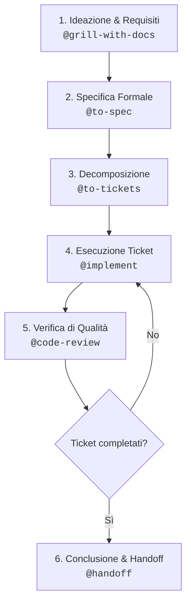

# My Agent Skills

Collezione curata e definitiva di **Skill per Agenti AI** (Antigravity, Claude Code, Gemini CLI, Cursor). Questa libreria raccoglie le migliori discipline di ingegneria del software, modellazione di dominio e flussi di lavoro per progettare, specificare, implementare e revisionare progetti software con l'ausilio dell'Intelligenza Artificiale.

---

## 🏛️ Architettura della Libreria: Due Livelli

La cartella è organizzata su due livelli distinti ma complementari:

```
my-agent-skills/
├── skill-primitive/      ← Motori interni & discipline cognitive (Model-invoked)
└── skill/                ← Flussi di lavoro operativi & task-oriented (User & Model invoked)
```

1. **`skill-primitive/` (Fondamenta cognitive / Regole invisibili)**:
   - Non sono pensate per essere lanciate direttamente dall'utente per produrre un deliverable isolato.
   - Fungono da **disciplina interna** del modello AI durante il lavoro: ad esempio, come condurre un'intervista socratica senza deviare (`grilling`), come mantenere il glossario di business (`domain-modeling`), come scrivere codice tramite test prima del codice (`tdd`), o come progettare moduli profondi con API semplici (`codebase-design`).
   - Hanno `disable-model-invocation: false` (possono attivarsi da sole quando il modello riconosce il contesto).

2. **`skill/` (Skill operative / Workflow concreti)**:
   - Sono i punti di ingresso per l'utente (tramite `@nome-skill` o slash commands) o wrapper che orchestrano le primitive.
   - Ogni skill produce un **deliverable concreto**: un documento di specifiche (`to-spec`), una suddivisione in ticket (`to-tickets`), codice implementato e testato (`implement`), una revisione del codice (`code-review`), o un riassunto di handoff (`handoff`).

---

## 📋 Catalogo Completo delle Skill

### 1. Skill Primitive (`skill-primitive/`)

| Skill | Modalità di Invocazione | Scopo Pratico | Casi d'Uso Tipici |
| :--- | :--- | :--- | :--- |
| [`codebase-design`](./skill-primitive/codebase-design/SKILL.md) | **Model-invoked** (Autonoma) | Impone la filosofia dei *Deep Modules* di John Ousterhout: interfacce semplici che nascondono implementazioni potenti ed eliminano complessità. | Quando si progetta una nuova architettura, un modulo, un package o si pianifica un refactoring strutturale. |
| [`domain-modeling`](./skill-primitive/domain-modeling/SKILL.md) | **Model-invoked** (Autonoma) | Costruisce attivamente il glossario di business del progetto (`CONTEXT.md`) e registra le Architectural Decision Records (`docs/adr/`). | Quando si discutono requisiti, si definiscono entità e relazioni di dominio o si prendono decisioni architetturali difficili da invertire. |
| [`grilling`](./skill-primitive/grilling/SKILL.md) | **Model-invoked** (Autonoma) | Disciplina di interrogazione socratica implacabile: fa una domanda alla volta per scavare a fondo nei requisiti prima di scrivere codice. | Utilizzata come motore interno di intervista in fase di ideazione per eliminare ogni ambiguità o assunzione nascosta. |
| [`tdd`](./skill-primitive/tdd/SKILL.md) | **Model-invoked** (Autonoma) | Guida ferrea al Test-Driven Development (Red-Green-Refactor) con enfasi su test d'integrazione e mock minimi. | Durante la scrittura di qualsiasi componente logico, business logic o API per garantire correttezza e zero regressioni. |

---

### 2. Skill Operative (`skill/`)

| Skill | Modalità di Invocazione | Scopo Pratico | Casi d'Uso Tipici |
| :--- | :--- | :--- | :--- |
| [`grill-me`](./skill/grill-me/SKILL.md) | **User-invoked** (`@grill-me`) | Avvia una sessione interattiva di interrogatorio su un'idea o una feature prima di toccare il codice. | Ideale all'inizio di una task o quando hai un'idea vaga e vuoi che l'AI ti metta alle strette per chiarirla. |
| [`grill-with-docs`](./skill/grill-with-docs/SKILL.md) | **User-invoked** (`@grill-with-docs`) | Combina l'interrogatorio socratico con la produzione contestuale del glossario `CONTEXT.md` e degli ADR ufficiali. | Quando inizi un progetto nuovo o una feature complessa e vuoi lasciare una traccia formale per il team. |
| [`to-spec`](./skill/to-spec/SKILL.md) | **User-invoked** (`@to-spec`) | Converte una conversazione o una sessione di grilling in un documento di specifica formale e strutturato. | Subito dopo aver chiarito i requisiti, per ottenere un documento chiaro approvabile prima di scrivere codice. |
| [`to-tickets`](./skill/to-tickets/SKILL.md) | **User-invoked** (`@to-tickets`) | Scompone una specifica in ticket autonomi a fette verticali (*vertical slices*) ordinati per dipendenza. | Per trasformare una spec in task pratici, adatti a essere eseguiti uno alla volta in sessioni pulite. |
| [`implement`](./skill/implement/SKILL.md) | **User-invoked** (`@implement`) | Esegue un ticket o una specifica applicando TDD rigoroso, typechecking continuo e code-review finale. | Per la fase di codifica vera e propria: passi il ticket e lasci che l'agente lo implementi con standard elevati. |
| [`code-review`](./skill/code-review/SKILL.md) | **User / Model** (`@code-review`) | Revisiona il codice su due assi paralleli: correttezza funzionale (test, edge-case) e pulizia/design architettonico. | Al termine di una feature, prima di fare il commit/merge, o per fare il refactoring di codice esistente. |
| [`diagnosing-bugs`](./skill/diagnosing-bugs/SKILL.md) | **User / Model** (`@diagnosing-bugs`) | Protocollo scientifico per scovare bug sfuggenti tramite ciclo isolato: ipotesi → test riproducibile → fix minimo. | Quando un test fallisce inaspettatamente, c'è un comportamento anomalo o non si riesce a trovare la causa radice. |
| [`prototype`](./skill/prototype/SKILL.md) | **User-invoked** (`@prototype`) | Genera spike di codice rapido e usa-e-getta (UI o logica) per rispondere a dubbi tecnici di fattibilità. | Quando vuoi esplorare se una libreria o una soluzione UI funziona visivamente prima di impegnarti nell'architettura finale. |
| [`handoff`](./skill/handoff/SKILL.md) | **User-invoked** (`@handoff`) | Comprime l'intera sessione corrente in un riassunto denso e strutturato per la prossima chat o sessione. | A fine giornata, quando la chat diventa troppo lunga, o prima di riavviare l'agente per continuare il lavoro domani. |
| [`to-questionnaire`](./skill/to-questionnaire/SKILL.md) | **User-invoked** (`@to-questionnaire`) | Converte una decisione tecnica o di prodotto in un questionario a risposte multiple chiaro e compilabile. | Quando devi raccogliere feedback o scelte dal cliente finale o da colleghi non tecnici senza fargli leggere gergo tecnico. |
| [`research`](./skill/research/SKILL.md) | **User-invoked** (`@research`) | Esegue un'analisi approfondita di documentazione, pacchetti npm o standard di settore e produce un report sintetico. | Prima di scegliere una libreria o quando bisogna integrare un'API di terze parti poco conosciuta. |
| [`writing-for-agents`](./skill/writing-for-agents/SKILL.md) | **User / Reference** | Guida di riferimento per scrivere prompt, istruzioni e nuove skill formattate in modo che gli agenti non sbaglino. | Quando vuoi creare una nuova skill personalizzata o documentare convenzioni per il tuo agente. |

---

## 🔗 Workflow Tipico (Chain di Esempio)

Come usare queste skill insieme in un progetto reale (es. *Creazione di una Web App / Sito Web per un Cliente*):



### Passaggi Dettagliati:

1. **Requisiti & Dominio**:
   - Lanci `@grill-with-docs`: l'agente ti sottopone a un'intervista socratica, estrae i termini chiave del cliente e crea contemporaneamente il file `CONTEXT.md` (es. cosa si intende per "Prenotazione", "Utente", "Fascia Oraria") e i primi ADR.
2. **Specifica Tecnica**:
   - Lanci `@to-spec`: l'agente riassume tutto ciò che è emerso nell'intervista in un documento `SPEC.md` chiaro, con requisiti funzionali, vincoli tecnici e criteri di accettazione.
3. **Pianificazione Operativa**:
   - Lanci `@to-tickets`: la specifica viene suddivisa in fette verticali (es. `ticket-01-database-schema`, `ticket-02-auth-flow`, `ticket-03-booking-ui`).
4. **Sviluppo TDD**:
   - Per ciascun ticket, lanci `@implement`: l'agente scrive prima i test (`tdd`), implementa la logica minima, verifica i tipi e lancia la suite di test.
5. **Revisione del Codice**:
   - Chiami `@code-review` per accertarti che il codice rispetti i principi di `codebase-design` e non introduca complessità accidentale.
6. **Passaggio di Consegne**:
   - Alla fine della sessione di lavoro o della giornata, lanci `@handoff`: l'agente produce un riassunto perfetto dello stato di avanzamento da riprendere nella prossima sessione.

---

## 🚀 Come Installare e Usare le Skill

### 1. Uso Locale per un Singolo Progetto (Consigliato)
Copia le skill desiderate nella cartella `.agents/skills/` del repository su cui stai lavorando:

```bash
# Esempio all'interno del tuo progetto:
mkdir -p .agents/skills/
cp -r /percorso/a/my-agent-skills/skill/grill-me .agents/skills/
cp -r /percorso/a/my-agent-skills/skill-primitive/grilling .agents/skills/
```

### 2. Uso Globale su Antigravity IDE (Disponibile in tutti i progetti)
Se desideri avere queste skill sempre pronte in qualunque workspace su Antigravity:
- Copia le cartelle all'interno di:
  `C:\Users\<TuoUtente>\.gemini\config\skills\`

### 3. Come Richiamarle in Chat
- Nelle chat di **Antigravity**, digita semplicemente `@` per visualizzare il completamento automatico delle skill disponibili (es. `@grill-me`, `@to-spec`, `@implement`).
- Le skill primitive come `domain-modeling`, `tdd` o `codebase-design` verranno lette e rispettate automaticamente dall'agente ogni volta che il contesto operativo lo richiede.
