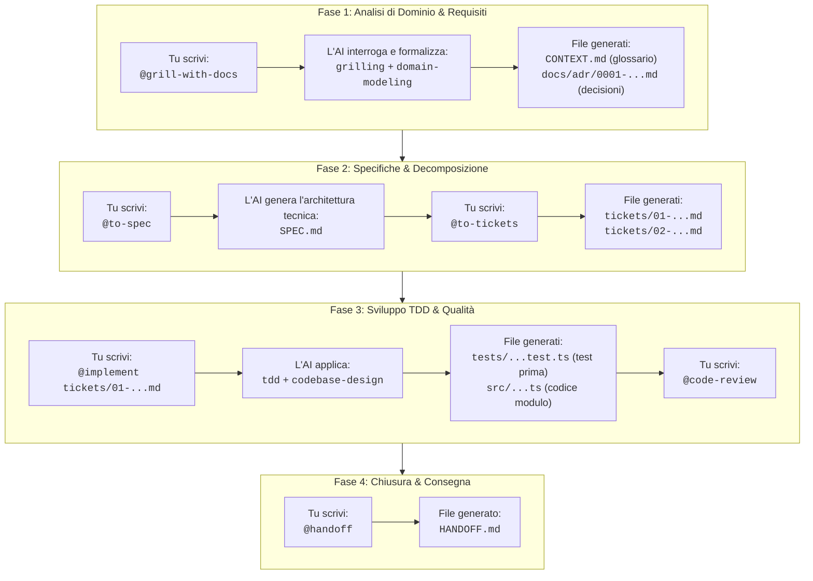
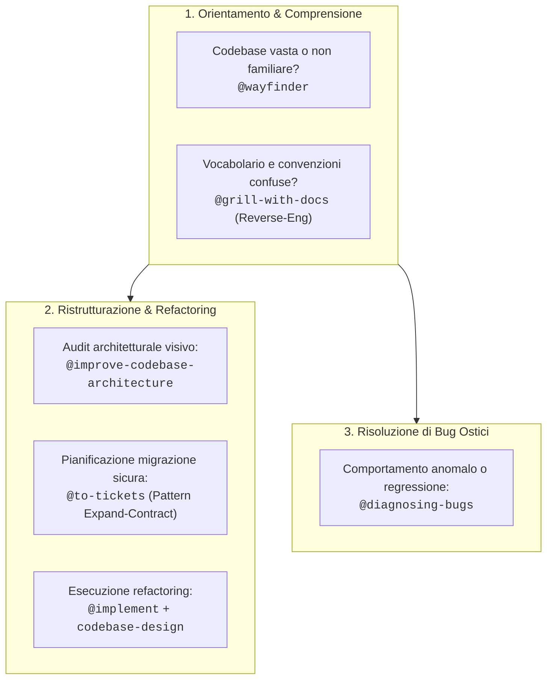
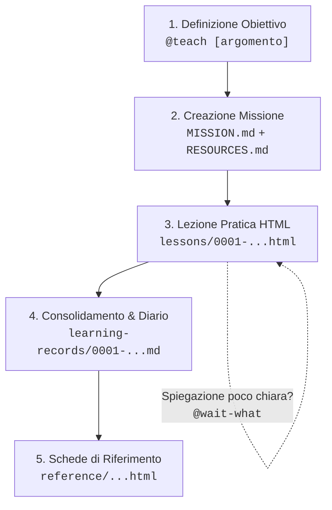

# My Agent Skills

Collezione curata e definitiva di **Skill per Agenti AI** (Antigravity, Claude Code, Gemini CLI, Cursor). Questa libreria raccoglie le migliori discipline di ingegneria del software, modellazione di dominio e flussi di lavoro per progettare, specificare, implementare e revisionare progetti software con l'ausilio dell'Intelligenza Artificiale.

---

## 🏛️ Architettura della Libreria: Due Livelli

La cartella è organizzata su due livelli distinti ma complementari:

```
my-agent-skills/
├── skill-primitive/      ← Motori interni & discipline cognitive (Model-invoked)
└── skill/                ← Flussi di lavoro operativi & task-oriented (User & Model invoked)
```

1. **`skill-primitive/` (Fondamenta cognitive / Regole invisibili)**:
   - Non sono pensate per essere lanciate direttamente dall'utente per produrre un deliverable isolato.
   - Fungono da **disciplina interna** del modello AI durante il lavoro: ad esempio, come condurre un'intervista socratica senza deviare (`grilling`), come mantenere il glossario di business (`domain-modeling`), come scrivere codice tramite test prima del codice (`tdd`), o come progettare moduli profondi con API semplici (`codebase-design`).
   - Hanno `disable-model-invocation: false` (possono attivarsi da sole quando il modello riconosce il contesto).

2. **`skill/` (Skill operative / Workflow concreti)**:
   - Sono i punti di ingresso per l'utente (tramite `@nome-skill` o slash commands) o wrapper che orchestrano le primitive.
   - Ogni skill produce un **deliverable concreto**: un documento di specifiche (`to-spec`), una suddivisione in ticket (`to-tickets`), codice implementato e testato (`implement`), una revisione del codice (`code-review`), o un riassunto di handoff (`handoff`).

---

## 📋 Catalogo Completo delle Skill (con Doppio Uso)

La maggior parte delle skill ha una **doppia modalità di utilizzo**: una per quando crei un software da zero (**Greenfield**) e una per quando intervieni su codice esistente, legacy o in produzione (**Brownfield**).

### 1. Skill Primitive (`skill-primitive/`) — Motori Cognitivi

| Skill | Modalità | 🟢 Uso in Nuovo Progetto (Greenfield) | 🟠 Uso in Progetto Già Avviato (Brownfield / Refactoring) |
| :--- | :--- | :--- | :--- |
| [`codebase-design`](./skill-primitive/codebase-design/SKILL.md) | **Model-invoked** (Autonoma) | Impone la progettazione iniziale di *Deep Modules*: interfacce snelle con logica potente e incapsulata. | Guida il refactoring strutturale: identifica moduli superficiali (*shallow*) e guida la loro unione e semplificazione. |
| [`domain-modeling`](./skill-primitive/domain-modeling/SKILL.md) | **Model-invoked** (Autonoma) | Costruisce da zero il glossario `CONTEXT.md` e registra le prime decisioni architetturali (ADR). | **Reverse-engineering del dominio**: scansiona il codice legacy, stana incoerenze nei nomi di classi/funzioni e genera il glossario. |
| [`grilling`](./skill-primitive/grilling/SKILL.md) | **Model-invoked** (Autonoma) | Intervista socratica implacabile per chiarire i requisiti e l'idea prima di scrivere codice. | Intervista sui vincoli di sistema prima di toccare codice critico, identificando rischi e impatti collaterali. |
| [`tdd`](./skill-primitive/tdd/SKILL.md) | **Model-invoked** (Autonoma) | Sviluppo di nuove funzionalità tramite ciclo Red-Green-Refactor guidato dai test. | **Scrittura di test di regressione** prima di toccare codice vecchio, per blindare il comportamento esistente mentre si rifattorizza. |

---

### 2. Skill Operative (`skill/`) — Workflow e Deliverables

| Skill | Modalità | 🟢 Uso in Nuovo Progetto (Greenfield) | 🟠 Uso in Progetto Già Avviato (Brownfield / Refactoring) |
| :--- | :--- | :--- | :--- |
| [`grill-me`](./skill/grill-me/SKILL.md) | **User-invoked** (`@grill-me`) | Intervista esplorativa informale e senza file scritti per mettere alla prova un'idea iniziale. | Brainstorming rapido su una singola modifica o su come affrontare un refactoring senza toccare file del repo. |
| [`grill-with-docs`](./skill/grill-with-docs/SKILL.md) | **User-invoked** (`@grill-with-docs`) | Intervista iniziale formale con generazione di `CONTEXT.md` e prime ADR ufficiali. | Allineamento del progetto: scansiona la codebase esistente e crea per la prima volta `CONTEXT.md` e ADR storiche. |
| [`to-spec`](./skill/to-spec/SKILL.md) | **User-invoked** (`@to-spec`) | Converte i requisiti emersi dall'intervista nella specifica tecnica del nuovo software (`SPEC.md`). | Formalizza le specifiche di una **grande migrazione**, di una nuova feature integrata o di un refactoring complesso. |
| [`to-tickets`](./skill/to-tickets/SKILL.md) | **User-invoked** (`@to-tickets`) | Scompone la specifica in fette verticali atomiche per l'implementazione ordinaria. | Scompone il refactoring con il pattern **Expand-Contract** (nuova interfaccia → migrazione chiamanti → rimozione legacy). |
| [`implement`](./skill/implement/SKILL.md) | **User-invoked** (`@implement`) | Implementa i nuovi ticket con TDD rigoroso, typechecking continuo e review finale. | Esegue modifiche o refactoring garantendo che l'intera suite di test esistente resti verde e senza regressioni. |
| [`code-review`](./skill/code-review/SKILL.md) | **User / Model** (`@code-review`) | Revisione finale delle nuove feature prima di fare commit o merge. | **Audit preventivo del codice legacy**: individua debiti tecnici, code smell e accoppiamenti prima di modificarli. |
| [`diagnosing-bugs`](./skill/diagnosing-bugs/SKILL.md) | **User / Model** (`@diagnosing-bugs`) | Risoluzione di test falliti o bug logici durante la scrittura iniziale del software. | **Isolamento scientifico di anomalie in produzione**: formula ipotesi e scrive test isolati prima di toccare codice a tentativi. |
| [`wayfinder`](./skill/wayfinder/SKILL.md) | **User-invoked** (`@wayfinder`) | Pianificazione di progetti enormi o complessi con troppa nebbia iniziale. | **Bussola di onboarding**: esplora e mappa codebase grandi o sconosciute tramite decision tickets sequenziali. |
| [`improve-codebase-architecture`](./skill/improve-codebase-architecture/SKILL.md) | **User-invoked** (`@improve-codebase-architecture`) | Verifica e consolidamento dell'architettura dopo i primi moduli sviluppati. | **Refactoring proattivo**: analizza la cronologia git, stana i punti caldi e genera un report HTML con diagrammi prima/dopo. |
| [`prototype`](./skill/prototype/SKILL.md) | **User-invoked** (`@prototype`) | Spike di codice rapido usa-e-getta per verificare la fattibilità dell'idea o della UI. | Verifica rapida di compatibilità prima di adottare una nuova libreria o algoritmo nella codebase esistente. |
| [`handoff`](./skill/handoff/SKILL.md) | **User-invoked** (`@handoff`) | Salva lo stato dei lavori al termine della sessione di ideazione o setup. | Snapshot dello stato dell'arte del progetto o passaggio di consegne ordinato prima di cambiare sessione o task. |
| [`to-questionnaire`](./skill/to-questionnaire/SKILL.md) | **User-invoked** (`@to-questionnaire`) | Questionario a risposte multiple per raccogliere i requisiti iniziali dal committente. | Questionario per sottoporre a clienti o colleghi decisioni di business (es. policy di deprecazione, migrazione dati). |
| [`teach`](./skill/teach/SKILL.md) | **User-invoked** (`@teach`) | Trasforma il workspace in un'aula virtuale per imparare nuove tecnologie o linguaggi da zero. | Studio guidato di nuove librerie, pattern o linguaggi necessari per la manutenzione o l'evoluzione del progetto. |
| [`wait-what`](./skill/wait-what/SKILL.md) | **User-invoked** (`@wait-what`) | Chiede all'AI di fermarsi e rispiegare un concetto teorico in termini semplici. | Freno d'emergenza quando l'AI spiega una parte intricata del codice legacy con troppo gergo incomprensibile. |
| [`research`](./skill/research/SKILL.md) | **User-invoked** (`@research`) | Ricerca approfondita di documentazione su pacchetti o librerie da adottare. | Studio di compatibilità tra versioni di dipendenze legacy o analisi di API terze da aggiornare. |
| [`writing-for-agents`](./skill/writing-for-agents/SKILL.md) | **User / Reference** | Scrittura di prompt, istruzioni e nuove skill per l'agente. | Redazione del file `AGENTS.md` del progetto per insegnare all'AI le convenzioni specifiche del codice aziendale. |

---

## 🔗 Workflow Completo Passo-Passo (Progettazione di un Software Generico)

Ecco il flusso di lavoro universale per **ideare, progettare, sviluppare e revisionare qualsiasi software**, dall'analisi iniziale dei requisiti al codice testato e collaudato.



---

### Step 1: Chiarire i Requisiti e Fissare i Termini (`@grill-with-docs`)

Prima di scrivere codice, metti l'AI in modalità "intervistatore implacabile" per eliminare ogni ambiguità nei requisiti, individuare i casi limite (*edge cases*) e formalizzare il vocabolario del software.

- **Cosa scrivi tu (Prompt):**
  ```text
  @grill-with-docs Devo progettare un nuovo software per [descrivi qui l'obiettivo o il problema che il software deve risolvere]. Fammi tutte le domande necessarie per chiarire i requisiti, sfidare le assunzioni e definire il vocabolario del dominio.
  ```
- **Cosa fa l'AI dietro le quinte:**
  - Attiva la primitiva `grilling`: ti interroga con una sola domanda alla volta su flussi principali, casi limite, fallimenti e vincoli tecnici.
  - Attiva la primitiva `domain-modeling`: man mano che i concetti chiave del software vengono chiariti, li registra formalmente.
- **File generati / modificati:**
  - 📄 [`CONTEXT.md`](./CONTEXT.md): Glossario ufficiale del software con entità, stati, regole e terminologia canonica (privo di codice, focalizzato sulle regole di business).
  - 📁 `docs/adr/0001-[decisione-architetturale].md`: Architectural Decision Record (ADR) che formalizza una scelta tecnica o architetturale non ovvia e difficile da invertire.

---

### Step 2: Trasformare l'Intervista in Specifica Tecnica (`@to-spec`)

Conclusa l'analisi dei requisiti, trasformi l'intera discussione in un documento formale di architettura e specifiche tecniche.

- **Cosa scrivi tu (Prompt):**
  ```text
  @to-spec Abbiamo chiarito tutti i requisiti e i vincoli. Ora genera il documento di specifica tecnica formale (SPEC.md) definendo architettura di sistema, contratti di interfaccia, modelli dati, flussi e criteri di accettazione.
  ```
- **Cosa fa l'AI:**
  Sintetizza i requisiti funzionali e non funzionali, i contratti di input/output, la gestione delle eccezioni e i criteri di collaudo in un documento strutturato.
- **File generati / modificati:**
  - 📄 [`SPEC.md`](./SPEC.md): Il documento tecnico di riferimento dell'intero progetto, pronto per essere approvato prima della fase di scrittura del codice.

---

### Step 3: Decomporre la Specifica in Ticket Autonomi (`@to-tickets`)

Un sistema software non si implementa in blocco: deve essere suddiviso in unità atomiche a fette verticali (*vertical slices*) ordinate per dipendenza.

- **Cosa scrivi tu (Prompt):**
  ```text
  @to-tickets Scomponi la SPEC.md in ticket di sviluppo autonomi a fette verticali, ordinati per dipendenza. Ogni ticket deve essere autosufficiente, implementabile e testabile in una singola sessione.
  ```
- **Cosa fa l'AI:**
  Analizza le dipendenze logiche tra i moduli e crea file separati per ciascun ticket con obiettivi chiari e criteri di accettazione.
- **File generati / modificati:**
  - 📁 `tickets/`
    - 📄 `tickets/01-[fondamenta-dati-e-storage].md`
    - 📄 `tickets/02-[logica-core-e-business-rules].md`
    - 📄 `tickets/03-[servizi-e-integrazioni].md`
    - 📄 `tickets/04-[interfaccia-pubblica-o-api].md`

---

### Step 4: Implementare un Ticket con TDD e Deep Modules (`@implement`)

Assegni all'agente un singolo ticket alla volta da sviluppare seguendo i massimi standard ingegneristici.

- **Cosa scrivi tu (Prompt):**
  ```text
  @implement Lavora sul ticket `tickets/01-[nome-ticket].md`. Applica TDD rigoroso: scrivi prima i test unitari e di integrazione per coprire casi ordinari ed edge cases, poi scrivi il codice minimo per farli passare.
  ```
- **Cosa fa l'AI dietro le quinte:**
  - Attiva `tdd`: scrive prima la suite di test che fallisce (**RED**), scrive l'implementazione minima necessaria affinché i test passino (**GREEN**), quindi pulisce il codice (**REFACTOR**).
  - Attiva `codebase-design`: progetta un modulo profondo (*Deep Module*) con un'interfaccia pubblica minimalista ed elegante che nasconde la complessità interna.
- **File generati / modificati:**
  - 📄 `tests/[modulo].test.ts`: Suite di test automatizzati per il modulo.
  - 📄 `src/[modulo].ts`: Codice sorgente del modulo.
  - 📄 `src/types.ts`: Definizioni dei tipi, interfacce e contratti pubblici.

---

### Step 5: Revisionare il Codice prima del Commit (`@code-review`)

Prima di considerare concluso il ticket ed eseguire il commit, effettui un controllo critico a due dimensioni.

- **Cosa scrivi tu (Prompt):**
  ```text
  @code-review Revisiona il codice implementato per il ticket prima di effettuare il commit. Verifica correttezza funzionale, assenza di regressioni, gestione degli errori e pulizia dell'architettura.
  ```
- **Cosa fa l'AI:**
  Revisiona il codice su due assi indipendenti:
  1. *Correttezza & Robustezza*: Verifica assenza di bug, memory leak, race condition e corretta gestione di tutti gli edge case.
  2. *Design & Semplicità*: Verifica che l'interfaccia non esponga dettagli interni non necessari (*information hiding*) e che rispetti la struttura del software.
- **File generati / modificati:**
  - Eventuali refactoring applicati direttamente al codice sorgente e semaforo verde per il commit Git.

---

### Step 6: Congelare lo Stato per la Prossima Sessione (`@handoff`)

A fine giornata o quando la finestra di contesto della chat diventa satura, generi un passaggio di consegne ordinato per riprendere senza attrito.

- **Cosa scrivi tu (Prompt):**
  ```text
  @handoff Abbiamo completato e testato con successo il ticket. Prepara un handoff completo per consentire a una nuova sessione di riprendere direttamente dal ticket successivo.
  ```
- **Cosa fa l'AI:**
  Sintetizza in modo compatto le decisioni prese, lo stato dei file, i test che passano e la prossima azione da intraprendere.
- **File generati / modificati:**
  - 📄 [`HANDOFF.md`](./HANDOFF.md) (oppure testo di handoff pronto per la chat successiva con riepilogo e puntamento ai file di lavoro).

---

## 🛠️ Flussi Secondari per Situazioni Specifiche

Durante il ciclo di vita del software possono verificarsi situazioni non lineari. Ecco come gestirle:

### A. Decisione Tecnica o di Progetto da Condividere (`@to-questionnaire`)
- **Situazione**: Devi prendere una decisione tra più opzioni (tecniche, architetturali o di prodotto) e vuoi raccogliere pareri o far decidere altri stakeholder senza affogarli nel gergo.
- **Prompt:**
  ```text
  @to-questionnaire Dobbiamo scegliere tra diverse opzioni per [argomento della decisione]. Prepara un questionario chiaro a scelte multiple, spiegando pro, contro e implicazioni in termini accessibili.
  ```
- **File generato:** `docs/QUESTIONARIO-[ARGOMENTO].md`.

### B. Bug Complesso o Regressione Inaspettata (`@diagnosing-bugs`)
- **Situazione**: Il software si comporta in modo anomalo o un test fallisce senza una causa evidente.
- **Prompt:**
  ```text
  @diagnosing-bugs Il software presenta un comportamento anomalo quando [descrivi il problema o l'errore]. Applica il metodo scientifico di diagnosi: formula le ipotesi, crea un test minimo isolato che riproduce il bug ed esegui il fix mirato.
  ```
- **File generati:** `tests/reproduce-[bug].test.ts` e fix mirato.

### C. Prototipo Rapido di Fattibilità Tecnica (`@prototype`)
- **Situazione**: Vuoi verificare rapidamente una libreria esterna, un algoritmo o una tecnologia prima di impegnarti nell'architettura finale.
- **Prompt:**
  ```text
  @prototype Crea uno spike rapido usa-e-getta per verificare la fattibilità di [tecnologia/algoritmo/componente]. Non implementare architetture complesse, solo codice minimo per testare il funzionamento.
  ```
- **File generati:** `src/prototypes/[nome-spike].ts`.

---

## 🔄 Workflow per Progetti Già Avviati (Refactoring, Manutenzione & Bug Fixing)

Quando devi intervenire su una **codebase esistente, legacy o già in produzione**, le priorità cambiano rispetto a un progetto nuovo: prima di scrivere codice devi comprendere la struttura esistente senza romperla, individuare dove c'è attrito (*friction*) e rifattorizzare con sicurezza.



---

### 1. Orientarsi in una Codebase Esistente o Complessa (`@wayfinder`)
- **Quando serve**: Sei entrato in un progetto già avviato, di grandi dimensioni o non familiare, e la strada per orientarsi è avvolta nella nebbia. Invece di provare a modificare codice alla cieca o farsi sopraffare dalla quantità di file, `wayfinder` traccia una mappa di "decision tickets" ed esplora la codebase in modo incrementale.
- **Prompt:**
  ```text
  @wayfinder Devo orientarmi su questa codebase esistente e pianificare [obiettivo della migrazione o feature da inserire]. Costruisci la mappa delle decisioni ed esplora l'architettura un passo alla volta.
  ```
- **Cosa fa l'AI**:
  Non modifica codice. Crea una mappa di ticket di esplorazione, risolve un dubbio architetturale per sessione e fa luce progressivamente sull'architettura (*clearing the fog of war*).

---

### 2. Manutenzione Proattiva e Ristrutturazione Moduli (`@improve-codebase-architecture`)
- **Quando serve**: Il software funziona, ma il codice è diventato disordinato, con moduli "troppo sottili" (*shallow modules*), logica sparsa o dipendenze aggrovigliate che rendono difficile aggiungere nuove feature o far lavorare bene gli agenti AI.
- **Prompt:**
  ```text
  @improve-codebase-architecture Scansiona la codebase esistente alla ricerca di opportunità di refactoring e deepening. Genera il report visivo HTML con i diagrammi prima/dopo per valutare dove intervenire.
  ```
- **Cosa fa l'AI**:
  1. Analizza lo storico Git (`git log`) per individuare i file modificati più di frequente (*hot spots*) e le aree a maggior complessità.
  2. Genera un report HTML completo e visivo (con grafici Mermaid prima/dopo e punteggio di raccomandazione) aprendolo direttamente nel tuo browser.
  3. Ti interroga sulle opzioni proposte per decidere insieme quale modulo consolidare (*Deep Module* di John Ousterhout).
- **Come eseguire il refactoring in sicurezza**:
  - Con `@to-tickets`, richiedi una scomposizione basata sul pattern **Expand-Contract**:
    1. *Expand*: Si introduce la nuova interfaccia profonda accanto al codice legacy.
    2. *Migrate*: Si spostano i chiamanti un componente alla volta mantenendo la test suite verde.
    3. *Contract*: Si rimuove il vecchio codice legacy senza mai bloccare il sistema.

---

### 3. Allineare il Vocabolario di un Progetto Legacy (`@grill-with-docs`)
- **Quando serve**: La codebase ha molti anni e i nomi delle classi, tabelle del database e funzioni non corrispondono più a come il business chiama le cose.
- **Prompt:**
  ```text
  @grill-with-docs Esamina il codice sorgente esistente in src/. Metti alla prova i termini usati, individua contraddizioni tra codice e regole di business, e crea per la prima volta il CONTEXT.md ufficiale del progetto.
  ```
- **Risultato**: Allineamento immediato tra te e l'agente sulle convenzioni e sul glossario reale del progetto, salvato in `CONTEXT.md` per tutte le sessioni future.

---

### 4. Risolvere Bug Ostici e Regressioni senza Rompere il Resto (`@diagnosing-bugs`)
- **Quando serve**: Si manifesta un bug intermittente, una race condition o un errore inspiegabile su codice già in produzione.
- **Prompt:**
  ```text
  @diagnosing-bugs Il software presenta questo comportamento inatteso: [dettagli o log dell'errore]. Non modificare il codice alla cieca: formula le ipotesi, crea un test minimo isolato che riproduce il bug e individua la causa radice prima di applicare il fix.
  ```
- **Risultato**: Rifiuta categoricamente modifiche a tentativi; applica il ciclo scientifico (ipotesi → test di riproduzione → root cause analysis → fix minimale e verifica di non-regressione).

---

## 🎓 Workflow Didattico: Apprendere Nuove Tecnologie (@teach & @wait-what)

Oltre allo sviluppo e alla manutenzione software, la libreria include un sistema avanzato per **utilizzare l'agente AI come tutor didattico personale**, strutturato secondo i principi delle scienze cognitive (ritenzione a lungo termine, richiamo attivo e zona di sviluppo prossimale).

Questo approccio è ideale sia per **studiare da zero un nuovo argomento** (es. un linguaggio come Rust o Go, l'architettura a eventi, Kubernetes) sia per **colmare lacune su una tecnologia complessa presente in un progetto già avviato**.



---

### 1. Avviare un Percorso di Studio Multi-Sessione (`@teach`)
- **Cosa scrivi tu (Prompt):**
  ```text
  @teach Vorrei imparare [argomento, es. 'Architettura a Microservizi e Domain-Driven Design' o 'Rust per Backend']. Il mio obiettivo pratico è [es. 'costruire servizi resilienti per il mio lavoro'].
  ```
- **Cosa fa l'AI**:
  Non produce un muro di testo temporaneo in chat: trasforma l'ambiente in un'aula virtuale interattiva persistente:
  - 📄 [`MISSION.md`](./MISSION.md): Formalizza lo scopo dell'apprendimento e il motivo pratico per cui vuoi padroneggiare la materia.
  - 📄 [`RESOURCES.md`](./RESOURCES.md): Raccoglie fonti primarie verificate (documentazione ufficiale, libri e articoli di riferimento).
  - 📁 `lessons/0001-[argomento].html`: Una lezione HTML auto-contenuta, pulita ed elegante (stile Tufte) focalizzata su una singola abilità, con piccoli quiz o verifiche pratiche, apribile nel browser.
  - 📁 `learning-records/0001-[concetto].md`: Un registro permanente delle intuizioni assimilate, utile all'agente per non ripetere concetti già acquisiti nelle sessioni successive.
  - 📁 `reference/`: Fogli riassuntivi, tabelle sintattiche e cheat-sheet per consultazione rapida.

---

### 2. Il Freno d'Emergenza Didattico (`@wait-what`)
- **Quando serve**: Durante lo studio o una discussione di codice, l'AI usa troppo gergo, compie salti concettuali o fornisce spiegazioni poco chiare.
- **Cosa scrivi tu (Prompt):**
  ```text
  @wait-what
  ```
- **Cosa fa l'AI**:
  Si ferma all'istante, azzera la spiegazione e la riformula in **Simplified Technical English** (frasi dirette, vocabolario comune ed esempi pratici terra-terra).

---

## 🚀 Come Installare e Usare le Skill

### 1. Uso Locale per un Singolo Progetto (Consigliato)
Copia le skill desiderate nella cartella `.agents/skills/` del repository su cui stai lavorando:

```bash
# Esempio all'interno del tuo progetto:
mkdir -p .agents/skills/
cp -r /percorso/a/my-agent-skills/skill/grill-me .agents/skills/
cp -r /percorso/a/my-agent-skills/skill-primitive/grilling .agents/skills/
```

### 2. Uso Globale su Antigravity IDE (Disponibile in tutti i progetti)
Se desideri avere queste skill sempre pronte in qualunque workspace su Antigravity:
- Copia le cartelle all'interno di:
  `C:\Users\<TuoUtente>\.gemini\config\skills\`

### 3. Come Richiamarle in Chat
- Nelle chat di **Antigravity**, digita semplicemente `@` per visualizzare il completamento automatico delle skill disponibili (es. `@grill-me`, `@to-spec`, `@implement`).
- Le skill primitive come `domain-modeling`, `tdd` o `codebase-design` verranno lette e rispettate automaticamente dall'agente ogni volta che il contesto operativo lo richiede.
