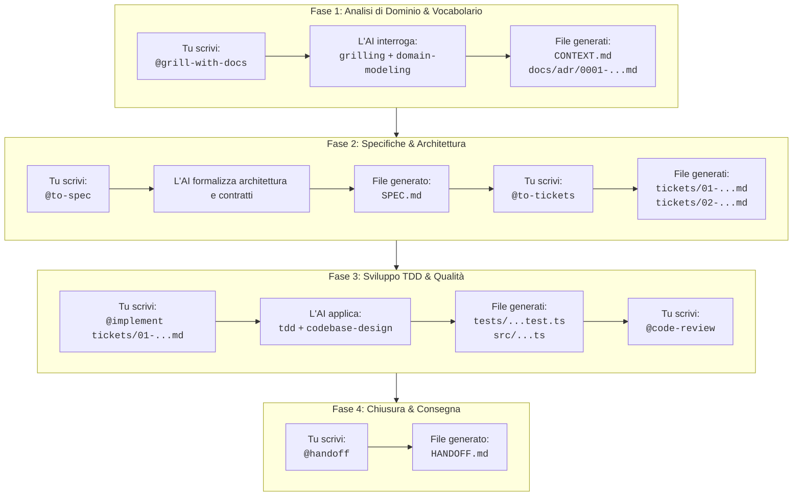

# My Agent Skills

Collezione curata e definitiva di **Skill per Agenti AI** (Antigravity, Claude Code, Gemini CLI, Cursor). Questa libreria raccoglie le migliori discipline di ingegneria del software, modellazione di dominio e flussi di lavoro per progettare, specificare, implementare e revisionare progetti software con l'ausilio dell'Intelligenza Artificiale.

---

## 🏛️ Architettura della Libreria: Due Livelli

La cartella è organizzata su due livelli distinti ma complementari:

```
my-agent-skills/
├── skill-primitive/      ← Motori interni & discipline cognitive (Model-invoked)
└── skill/                ← Flussi di lavoro operativi & task-oriented (User & Model invoked)
```

1. **`skill-primitive/` (Fondamenta cognitive / Regole invisibili)**:
   - Non sono pensate per essere lanciate direttamente dall'utente per produrre un deliverable isolato.
   - Fungono da **disciplina interna** del modello AI durante il lavoro: ad esempio, come condurre un'intervista socratica senza deviare (`grilling`), come mantenere il glossario di business (`domain-modeling`), come scrivere codice tramite test prima del codice (`tdd`), o come progettare moduli profondi con API semplici (`codebase-design`).
   - Hanno `disable-model-invocation: false` (possono attivarsi da sole quando il modello riconosce il contesto).

2. **`skill/` (Skill operative / Workflow concreti)**:
   - Sono i punti di ingresso per l'utente (tramite `@nome-skill` o slash commands) o wrapper che orchestrano le primitive.
   - Ogni skill produce un **deliverable concreto**: un documento di specifiche (`to-spec`), una suddivisione in ticket (`to-tickets`), codice implementato e testato (`implement`), una revisione del codice (`code-review`), o un riassunto di handoff (`handoff`).

---

## 📋 Catalogo Completo delle Skill

### 1. Skill Primitive (`skill-primitive/`)

| Skill | Modalità di Invocazione | Scopo Pratico | Casi d'Uso Tipici |
| :--- | :--- | :--- | :--- |
| [`codebase-design`](./skill-primitive/codebase-design/SKILL.md) | **Model-invoked** (Autonoma) | Impone la filosofia dei *Deep Modules* di John Ousterhout: interfacce semplici che nascondono implementazioni potenti ed eliminano complessità. | Quando si progetta una nuova architettura, un modulo, un package o si pianifica un refactoring strutturale. |
| [`domain-modeling`](./skill-primitive/domain-modeling/SKILL.md) | **Model-invoked** (Autonoma) | Costruisce attivamente il glossario di business del progetto (`CONTEXT.md`) e registra le Architectural Decision Records (`docs/adr/`). | Quando si discutono requisiti, si definiscono entità e relazioni di dominio o si prendono decisioni architetturali difficili da invertire. |
| [`grilling`](./skill-primitive/grilling/SKILL.md) | **Model-invoked** (Autonoma) | Disciplina di interrogazione socratica implacabile: fa una domanda alla volta per scavare a fondo nei requisiti prima di scrivere codice. | Utilizzata come motore interno di intervista in fase di ideazione per eliminare ogni ambiguità o assunzione nascosta. |
| [`tdd`](./skill-primitive/tdd/SKILL.md) | **Model-invoked** (Autonoma) | Guida ferrea al Test-Driven Development (Red-Green-Refactor) con enfasi su test d'integrazione e mock minimi. | Durante la scrittura di qualsiasi componente logico, business logic o API per garantire correttezza e zero regressioni. |

---

### 2. Skill Operative (`skill/`)

| Skill | Modalità di Invocazione | Scopo Pratico | Casi d'Uso Tipici |
| :--- | :--- | :--- | :--- |
| [`grill-me`](./skill/grill-me/SKILL.md) | **User-invoked** (`@grill-me`) | Avvia una sessione interattiva di interrogatorio su un'idea o una feature prima di toccare il codice. | Ideale all'inizio di una task o quando hai un'idea vaga e vuoi che l'AI ti metta alle strette per chiarirla. |
| [`grill-with-docs`](./skill/grill-with-docs/SKILL.md) | **User-invoked** (`@grill-with-docs`) | Combina l'interrogatorio socratico con la produzione contestuale del glossario `CONTEXT.md` e degli ADR ufficiali. | Quando inizi un progetto nuovo o una feature complessa e vuoi lasciare una traccia formale per il team. |
| [`to-spec`](./skill/to-spec/SKILL.md) | **User-invoked** (`@to-spec`) | Converte una conversazione o una sessione di grilling in un documento di specifica formale e strutturato. | Subito dopo aver chiarito i requisiti, per ottenere un documento chiaro approvabile prima di scrivere codice. |
| [`to-tickets`](./skill/to-tickets/SKILL.md) | **User-invoked** (`@to-tickets`) | Scompone una specifica in ticket autonomi a fette verticali (*vertical slices*) ordinati per dipendenza. | Per trasformare una spec in task pratici, adatti a essere eseguiti uno alla volta in sessioni pulite. |
| [`implement`](./skill/implement/SKILL.md) | **User-invoked** (`@implement`) | Esegue un ticket o una specifica applicando TDD rigoroso, typechecking continuo e code-review finale. | Per la fase di codifica vera e propria: passi il ticket e lasci che l'agente lo implementi con standard elevati. |
| [`code-review`](./skill/code-review/SKILL.md) | **User / Model** (`@code-review`) | Revisiona il codice su due assi paralleli: correttezza funzionale (test, edge-case) e pulizia/design architettonico. | Al termine di una feature, prima di fare il commit/merge, o per fare il refactoring di codice esistente. |
| [`diagnosing-bugs`](./skill/diagnosing-bugs/SKILL.md) | **User / Model** (`@diagnosing-bugs`) | Protocollo scientifico per scovare bug sfuggenti tramite ciclo isolato: ipotesi → test riproducibile → fix minimo. | Quando un test fallisce inaspettatamente, c'è un comportamento anomalo o non si riesce a trovare la causa radice. |
| [`prototype`](./skill/prototype/SKILL.md) | **User-invoked** (`@prototype`) | Genera spike di codice rapido e usa-e-getta (UI o logica) per rispondere a dubbi tecnici di fattibilità. | Quando vuoi esplorare se una libreria o una soluzione UI funziona visivamente prima di impegnarti nell'architettura finale. |
| [`handoff`](./skill/handoff/SKILL.md) | **User-invoked** (`@handoff`) | Comprime l'intera sessione corrente in un riassunto denso e strutturato per la prossima chat o sessione. | A fine giornata, quando la chat diventa troppo lunga, o prima di riavviare l'agente per continuare il lavoro domani. |
| [`to-questionnaire`](./skill/to-questionnaire/SKILL.md) | **User-invoked** (`@to-questionnaire`) | Converte una decisione tecnica o di prodotto in un questionario a risposte multiple chiaro e compilabile. | Quando devi raccogliere feedback o scelte dal cliente finale o da colleghi non tecnici senza fargli leggere gergo tecnico. |
| [`research`](./skill/research/SKILL.md) | **User-invoked** (`@research`) | Esegue un'analisi approfondita di documentazione, pacchetti npm o standard di settore e produce un report sintetico. | Prima di scegliere una libreria o quando bisogna integrare un'API di terze parti poco conosciuta. |
| [`writing-for-agents`](./skill/writing-for-agents/SKILL.md) | **User / Reference** | Guida di riferimento per scrivere prompt, istruzioni e nuove skill formattate in modo che gli agenti non sbaglino. | Quando vuoi creare una nuova skill personalizzata o documentare convenzioni per il tuo agente. |

---

## 🔗 Workflow Completo Passo-Passo (Esempio Generale di Software)

Ecco come si utilizzano concretamente queste skill nel ciclo di vita di un **qualsiasi progetto software** (un'applicazione, un microservizio, una libreria o una piattaforma complessa), dall'idea embrionale al codice collaudato.

Immaginiamo un caso reale: **"Progettazione e sviluppo di un nuovo servizio software per l'Elaborazione Transazioni & Macchina a Stati (Transactions & Task Engine)"**.



---

### Step 1: Chiarire i Requisiti e Fissare i Termini (`@grill-with-docs`)

Prima di scrivere una sola riga di codice, metti l'AI in modalità "intervistatore implacabile" per eliminare ogni ambiguità nei requisiti, individuare casi limite (*edge cases*) e formalizzare il vocabolario del software.

- **Cosa scrivi tu (Prompt):**
  ```text
  @grill-with-docs Devo progettare un nuovo servizio software per l'elaborazione di transazioni asincrone con una macchina a stati. Fammi tutte le domande necessarie per chiarire i requisiti, sfidare le mie assunzioni su fallimenti, concorrenza e definire il vocabolario di dominio.
  ```
- **Cosa fa l'AI dietro le quinte:**
  - Attiva la primitiva `grilling`: ti interroga con una sola domanda alla volta (es: *"Cosa succede se una transazione fallisce a metà? Il sistema supporta l'idempotenza? Gli stati possono regredire o sono solo transizioni in avanti? Come gestiamo i timeout?"*).
  - Attiva la primitiva `domain-modeling`: man mano che stabilite concetti chiave (es. differenza formale tra *Pending*, *Settled* e *Failed*), li registra immediatamente nel glossario.
- **File generati / modificati:**
  - 📄 [`CONTEXT.md`](./CONTEXT.md): Glossario ufficiale del sistema con entità, stati e regole di business (nessun dettaglio di framework, solo logica pura di dominio).
  - 📁 `docs/adr/0001-transizioni-esplicite-state-machine.md`: Architectural Decision Record (ADR) che documenta la scelta di una macchina a stati finiti (FSM) rigorosa per scongiurare stati inconsistenti a fronte di carichi concorrenti.

---

### Step 2: Trasformare l'Intervista in Specifica Tecnica (`@to-spec`)

Conclusa l'analisi dei requisiti, trasformi l'intera discussione in un documento tecnico formale di architettura e design.

- **Cosa scrivi tu (Prompt):**
  ```text
  @to-spec Abbiamo chiarito tutti i requisiti e i limiti operativi. Ora genera il documento di specifica tecnica completo (SPEC.md) definendo contratti di interfaccia, schema dati, gestione errori e criteri di accettazione.
  ```
- **Cosa fa l'AI:**
  Sintetizza i requisiti funzionali e non funzionali, i payload di input/output, i meccanismi di retry e i criteri di collaudo.
- **File generati / modificati:**
  - 📄 [`SPEC.md`](./SPEC.md): La guida tecnica definitiva del sistema, con modelli dati, sequenze di chiamata, contratti API/libreria e acceptance criteria verificabili.

---

### Step 3: Decomporre la Specifica in Ticket Autonomi (`@to-tickets`)

Un sistema software non si implementa in un blocco unico. Bisogna scomporlo in unità di lavoro atomiche (*vertical slices*) ordinate per dipendenze.

- **Cosa scrivi tu (Prompt):**
  ```text
  @to-tickets Scomponi la SPEC.md in ticket di sviluppo autonomi, ciascuno realizzabile e testabile in una singola sessione di lavoro.
  ```
- **Cosa fa l'AI:**
  Analizza le dipendenze logiche e crea ticket verticali (storage + core logic + test per ciascuna funzionalità).
- **File generati / modificati:**
  - 📁 `tickets/`
    - 📄 `tickets/01-schema-dati-e-interfacce-dominio.md` (Definizione tipi, entità base e storage layer)
    - 📄 `tickets/02-motore-macchina-a-stati-core.md` (Logica pura di transizione stati e validazione invarianti)
    - 📄 `tickets/03-servizio-elaborazione-transazioni-e-retry.md` (Gestione asincrona, idempotenza e failure recovery)
    - 📄 `tickets/04-interfaccia-pubblica-api-e-integrazione.md` (Esposizione API/SDK con contratti pubblici)

---

### Step 4: Implementare un Ticket con TDD e Deep Modules (`@implement`)

Assegni all'agente un singolo ticket alla volta da sviluppare con i massimi standard ingegneristici.

- **Cosa scrivi tu (Prompt):**
  ```text
  @implement Lavora sul ticket `tickets/02-motore-macchina-a-stati-core.md`. Segui rigorosamente il TDD: scrivi prima i test unitari per coprire tutte le transizioni lecite ed edge cases (transizioni illegali, tentativi concorrenti), poi sviluppa il codice minimo.
  ```
- **Cosa fa l'AI dietro le quinte:**
  - Attiva `tdd`: scrive prima la suite di test che fallisce (**RED**), scrive l'implementazione minima necessaria affinché i test passino (**GREEN**), quindi effettua il refactoring (**REFACTOR**).
  - Attiva `codebase-design`: adotta il principio dei *Deep Modules* (interfaccia pubblica snella ed elegante che nasconde internamente tutta la complessità di validazione e locking).
- **File generati / modificati:**
  - 📄 `tests/core/state-machine.test.ts`: Suite di test completa (casi positivi, eccezioni, condizioni al contorno).
  - 📄 `src/core/state-machine.ts`: Implementazione del modulo con incapsulamento rigoroso.
  - 📄 `src/core/types.ts`: Contratti di tipo pubblici e sicuri.

---

### Step 5: Revisionare il Codice prima del Commit (`@code-review`)

Prima di unire o inviare il codice, effettui un controllo di qualità parallelo a due dimensioni.

- **Cosa scrivi tu (Prompt):**
  ```text
  @code-review Revisiona il codice implementato per il ticket 02 prima di effettuare il commit.
  ```
- **Cosa fa l'AI:**
  Revisiona il codice su due assi indipendenti:
  1. *Correttezza & Robustezza*: Verifica potenziale memory leak, deadlock, race condition, gestione inadeguata di errori o corner cases scoperti.
  2. *Design & Semplicità*: Verifica che l'interfaccia non esponga dettagli interni non necessari (*information leakage*) e rispetti l'architettura.
- **File generati / modificati:**
  - Eventuali refactoring applicati direttamente al codice sorgente e semaforo verde per il commit Git.

---

### Step 6: Congelare lo Stato per la Prossima Sessione (`@handoff`)

A fine sessione, o quando il contesto della finestra chat diventa saturo, crei un passaggio di consegne pulito per ripartire senza attriti.

- **Cosa scrivi tu (Prompt):**
  ```text
  @handoff Abbiamo completato e testato con successo il ticket 02. Prepara un handoff completo per consentire a una nuova sessione di riprendere direttamente dal ticket 03.
  ```
- **Cosa fa l'AI:**
  Sintetizza in modo compatto le decisioni architetturali prese, lo stato dei file, i test attivi e il prossimo obiettivo.
- **File generati / modificati:**
  - 📄 [`HANDOFF.md`](./HANDOFF.md) (oppure prompt compatto da incollare nella chat successiva: *"Stato: Ticket 01 e 02 completati e testati al 100%. Prossimo obiettivo: Ticket 03 (`servizio-elaborazione-transazioni`). Leggi `SPEC.md` e `tickets/03-...md` per procedere."*).

---

## 🛠️ Flussi Secondari per Situazioni Specifiche

Durante lo sviluppo di software emergono regolarmente situazioni non lineari. Ecco come gestirle:

### A. Decisione Tecnica o di Prodotto da Condividere (`@to-questionnaire`)
- **Situazione**: Devi decidere tra due strategie architetturali (es. *Storage SQL vs Event-Sourced*, oppure *Politica di retry lineare vs exponential backoff*) e vuoi raccogliere input dal team o dal committente.
- **Prompt:**
  ```text
  @to-questionnaire Dobbiamo decidere la strategia di persistenza e la politica di retry per le transazioni fallite. Prepara un questionario chiaro a risposte multiple, spiegando pro e contro in termini semplici.
  ```
- **File generato:** `docs/QUESTIONARIO-STRATEGIA-RETRY.md`.

### B. Bug Complesso o Regressione Inaspettata (`@diagnosing-bugs`)
- **Situazione**: Una transazione restituisce uno stato inatteso durante un test di carico e la causa è sconosciuta.
- **Prompt:**
  ```text
  @diagnosing-bugs Il servizio fallisce intermittentemente quando riceve due eventi simultanei per la stessa transazione. Applica il metodo scientifico di diagnosi: formula le ipotesi, scrivi un test minimo isolato che riproduce il bug ed esegui il fix mirato.
  ```
- **File generati:** `tests/reproduce-race-condition.test.ts` e fix mirato.

### C. Prototipo Rapido di Fattibilità Tecnica (`@prototype`)
- **Situazione**: Vuoi verificare se una specifica libreria o un algoritmo di hashing/crittografia soddisfa i requisiti di performance prima di scriverlo nella specifica formale.
- **Prompt:**
  ```text
  @prototype Crea uno spike rapido e usa-e-getta per misurare il throughput di questa libreria di serializzazione. Non creare astrazioni o architettura formale, solo codice minimo per raccogliere metriche.
  ```
- **File generati:** `src/prototypes/throughput-spike.ts`.

---

## 🚀 Come Installare e Usare le Skill

### 1. Uso Locale per un Singolo Progetto (Consigliato)
Copia le skill desiderate nella cartella `.agents/skills/` del repository su cui stai lavorando:

```bash
# Esempio all'interno del tuo progetto:
mkdir -p .agents/skills/
cp -r /percorso/a/my-agent-skills/skill/grill-me .agents/skills/
cp -r /percorso/a/my-agent-skills/skill-primitive/grilling .agents/skills/
```

### 2. Uso Globale su Antigravity IDE (Disponibile in tutti i progetti)
Se desideri avere queste skill sempre pronte in qualunque workspace su Antigravity:
- Copia le cartelle all'interno di:
  `C:\Users\<TuoUtente>\.gemini\config\skills\`

### 3. Come Richiamarle in Chat
- Nelle chat di **Antigravity**, digita semplicemente `@` per visualizzare il completamento automatico delle skill disponibili (es. `@grill-me`, `@to-spec`, `@implement`).
- Le skill primitive come `domain-modeling`, `tdd` o `codebase-design` verranno lette e rispettate automaticamente dall'agente ogni volta che il contesto operativo lo richiede.
